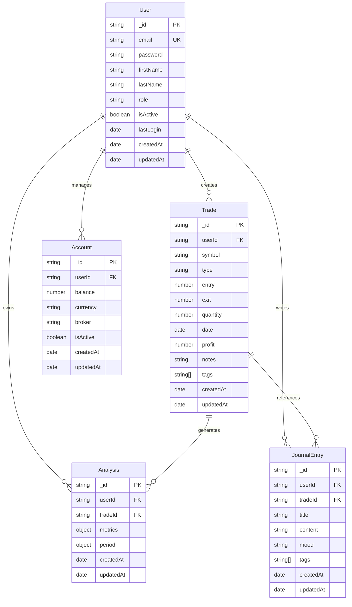

# Database Schema Documentation

## Entity Relationship Diagram



## Model Details

### User
- Primary key: `_id` (ObjectId)
- Unique fields: `email`
- Required fields: `email`, `password`, `firstName`, `lastName`
- Indexes:
  - `email`: unique index
- Relationships:
  - One-to-many with Trade
  - One-to-many with Analysis
  - One-to-many with Account
  - One-to-many with JournalEntry

### Trade
- Primary key: `_id` (ObjectId)
- Required fields: `userId`, `symbol`, `type`, `entry`, `quantity`, `date`
- Indexes:
  - `userId`: for querying user's trades
  - `symbol`: for filtering by symbol
  - `date`: for date range queries
- Relationships:
  - Many-to-one with User
  - One-to-many with Analysis
  - One-to-many with JournalEntry

### Analysis
- Primary key: `_id` (ObjectId)
- Required fields: `userId`, `tradeId`, `metrics`, `period`
- Indexes:
  - `userId`: for querying user's analyses
  - `tradeId`: for finding trade analyses
  - `period.start` and `period.end`: for date range queries
- Relationships:
  - Many-to-one with User
  - Many-to-one with Trade

### Account
- Primary key: `_id` (ObjectId)
- Required fields: `userId`, `balance`, `currency`, `broker`
- Indexes:
  - `userId`: for querying user's accounts
- Relationships:
  - Many-to-one with User

### JournalEntry
- Primary key: `_id` (ObjectId)
- Required fields: `userId`, `title`, `content`
- Optional fields: `tradeId`, `mood`, `tags`
- Indexes:
  - `userId`: for querying user's journal entries
  - `tradeId`: for finding trade-related entries
  - `tags`: for filtering by tags
- Relationships:
  - Many-to-one with User
  - Many-to-one with Trade

## Data Types

### Trade Types
- `type`: enum ['buy', 'sell']

### Mood Types
- `mood`: enum ['positive', 'neutral', 'negative']

### User Roles
- `role`: enum ['user', 'admin']

### Metrics Object
```typescript
{
  riskRewardRatio: number;
  winRate: number;
  profitFactor: number;
  averageWin: number;
  averageLoss: number;
}
```

### Period Object
```typescript
{
  start: Date;
  end: Date;
}
```

## Indexes and Performance

The following indexes are created to optimize common queries:

1. User Collection:
   - `email`: unique index for login and registration
   - `role`: index for role-based queries

2. Trade Collection:
   - `userId`: index for fetching user's trades
   - `symbol`: index for filtering trades by symbol
   - `date`: index for date range queries
   - Compound index on `userId` and `date` for paginated queries

3. Analysis Collection:
   - `userId`: index for fetching user's analyses
   - `tradeId`: index for trade-specific analyses
   - Compound index on `period.start` and `period.end` for date range queries

4. Account Collection:
   - `userId`: index for fetching user's accounts
   - `broker`: index for filtering by broker

5. JournalEntry Collection:
   - `userId`: index for fetching user's journal entries
   - `tradeId`: index for trade-specific entries
   - `tags`: index for filtering by tags
   - Compound index on `userId` and `createdAt` for paginated queries

## Data Validation

Each model includes built-in validation:

1. User:
   - Email format validation
   - Password minimum length (8 characters)
   - Required fields validation

2. Trade:
   - Valid trade type check
   - Positive quantity validation
   - Date validation

3. Analysis:
   - Valid metric ranges
   - Period date validation
   - Required fields validation

4. Account:
   - Positive balance validation
   - Valid currency format
   - Required fields validation

5. JournalEntry:
   - Valid mood enum value
   - Title and content length validation
   - Tags array validation

## Timestamps

All collections include automatic timestamp fields:
- `createdAt`: Set on document creation
- `updatedAt`: Updated on document modification 